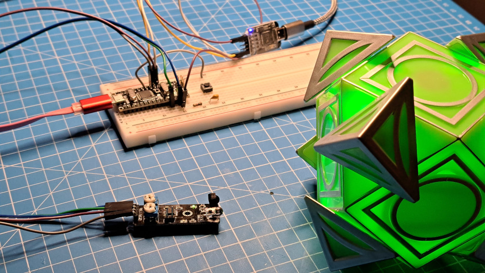

# Holocron Toolbox
This is an [Arduino IDE](https://www.arduino.cc/en/software) sketch for interfacing with Galaxy's Edge Holocrons via infrared 
using a [KY-032 IR Obstacle Avoidance Sensor](https://www.ebay.com/sch/i.html?_nkw=KY-032&_sacat=0), although other IR transmitter
and receiver modules should be compatible with light modification.

*Thise code is presented AS-IS without warranty. Use at your own risk.*

## A Work In Progress
This code is very much a work in progress. Features may be buggy or missing altogether. Questionable choices in
code functionality may be found throughout the source. I've tried to document my intentions in the hopes you may
find them somewhat understandable. Good luck!

## Hardware Setup
I have an [Arduino Nano](https://www.ebay.com/sch/i.html?_nkw=Arduino%20Nano) wired up to a 
[KY-032 IR module](https://www.ebay.com/sch/i.html?_nkw=KY-032&_sacat=0).
The GND and + pins of the KY-032 are attached to GND and 5V respectively on the Nano. The OUT pin is attached to 
digital pin 2 (IR_RECV_PIN), and the EN(able) pin is wired to digital pin 3 (IR_SEND_PIN).

The IR module has a jumper on it. When in place, the transmitter is always on. For this project to work, you need to 
remove that jumper. Without the jumper, the transmitter is turned on by seting that pin HIGH.

The IR module uses an on-board 555 timer to generate a high frequency square wave used by the IR transmitter. This
frequency can be tuned using the potentiometer on the module that is closest to the EN(able) pin. Holocrons use a 
38kHz carrier wave, which is achieveable with the potentiometer tuned to its halfway point. If needed you can fine-tune it
by pointing it at a holocron and changing the potentiometer until the Nano reports that it sees the holocron.

I also have a button with one end connected to digital pin 5 and the other connected to ground via a 1k resistor. The resistor
is not necessary as I am using the internal pullup resistor of the ATMega328P, but it may be required for you if you're using 
different hardware. A small (100nF) capactor is in parallel with the button in a hopeless attempt to prevent debouncing, but I'll
probably fix it with code, later.

## Usage / Features
Currently the code will detect a Jedi holocron and report seeing it via the serial monitor. When ready, press the button and
it will (attempt to) pair with the holocron. Once paired, press the button again to simulate pressing the button of a Sith holocron.

If you remove the holocron from the view of the sensor or turn if off the code will, after 10 seconds of inactivity, revert
to looking for a new holocron.

More features, such as getting it to work with a Sith holocron, are in the on the mental list of things to do.

## Good Luck!
